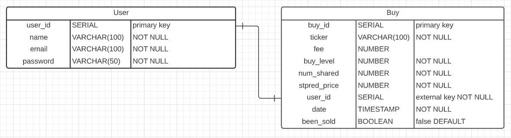

# portfolioTracker

## Team:

- Monica
- Moony
- Shav
- Akash

## General Purpose of the App:

Allow users the ability to track their portfolio, with their chosen stocks, monitoring the individual price changes, returning their profit/loss on their investments, trace the movement of their individual holdings and get a general idea of how their portfolio is doing.

## Features:

- Users are able to login
- Users are able to track their portfolio.
- Users are able to track their and mark it as complete for the month.
- Users are able to see if they have completed a habit for the day and see their most recent completion streak.
- Users are able to delete themself from the app

## Installation & Usage

### Prerequisites
- Docker

### Installation
- Clone or download the repo

### Usage
- Go to the project folder
- Open the bash terminal
- Run: bash _scripts/startDev.sh
- You will find:
  - Client in [localhost:8080](http://localhost:8080/)
  - Server in [localhost:5000](http://localhost:5000/)
- To close the app:
  - Open a new bash terminal in the project folder
  - Run: bash _scripts/stop.sh
- To perfom a complete teardown of the app:
  - Open a new bash terminal in the project folder
  - Run: bash _scripts/teardown.sh
  
## Technologies:

- Non relational database- PostgreSQL
- Node
- Express
- HTML,CSS and JS
- CORS
- AWS
- Nodemon
- BCrypt
- JWT Tokens

## Database Schema

## Client Endpoints

 - `/# || /#home || /#portfolio` Home page, will show a "please login" if not and if yes, home is where the portfolio is. (the portfolio change the main container)
 - `/#login` Show the login form (this form change the main container) Needs no Token
 - `/#invest` Show the do an investment form (this form overlap main) Needs Token
 - `/#sell` Show the sell an investment form (this form overlap main) Needs Token
 - `/#logout` It triggers the delete of the session token and it returns to the home page 
 - `/#error` 404 Page not found (change main)

## API Endpoints

### Post 

| Route Name | URL | HTTP Verb | Description |
|-----|----|----|--|
| Create | /user | POST | Create a new user | 
| Create | /buys | POST | User buy new stock |
| Create | /sells | POST | User sold old stock |

### Get

| Route Name | URL | HTTP Verb | Description |
|-----|----|----|--|
| Root | / | GET | api started |
| Show | /user/:id | GET | Retrieve all the sell and buy of a user |
| Show | /buys/:id | GET | Show a particular buy |

###  Update

| Route Name | URL | HTTP Verb | Description |
|-----|----|----|--|
| Update | /buys/ | PATCH | Make smaller the num of shares |

### Delete

| Route Name | URL | HTTP Verb | Description |
|-----|----|----|--|
| Destroy | /user | DELETE | Destroy user and their buys history |
| Destroy | /buys/ | DELETE | Destroy a buy because it has been sold |
| Destroy | /sells/ | DELETE | Destroy a sell because user wants |

## Changelog 

Find the full changelog [here](./changelog.md)

## License

[MIT License](https://opensource.org/licenses/mit-license.php)
